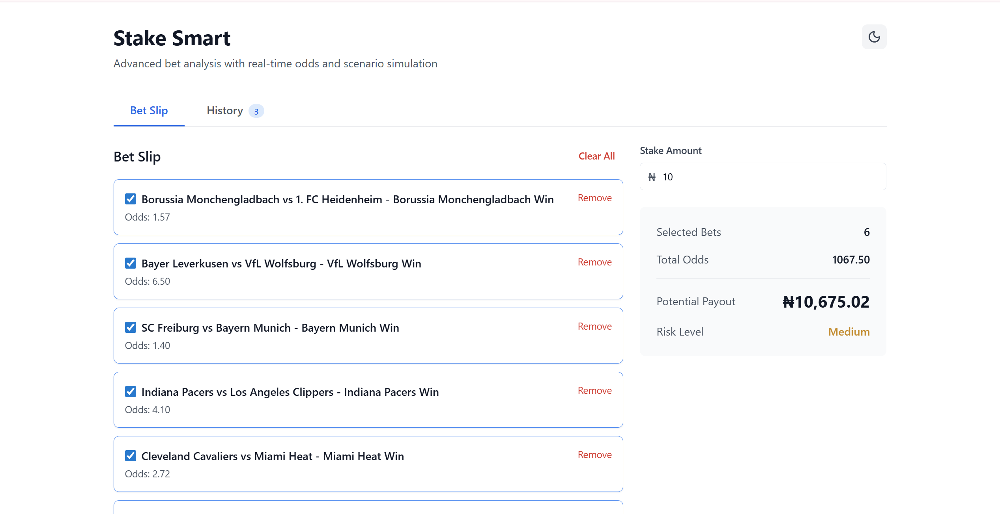
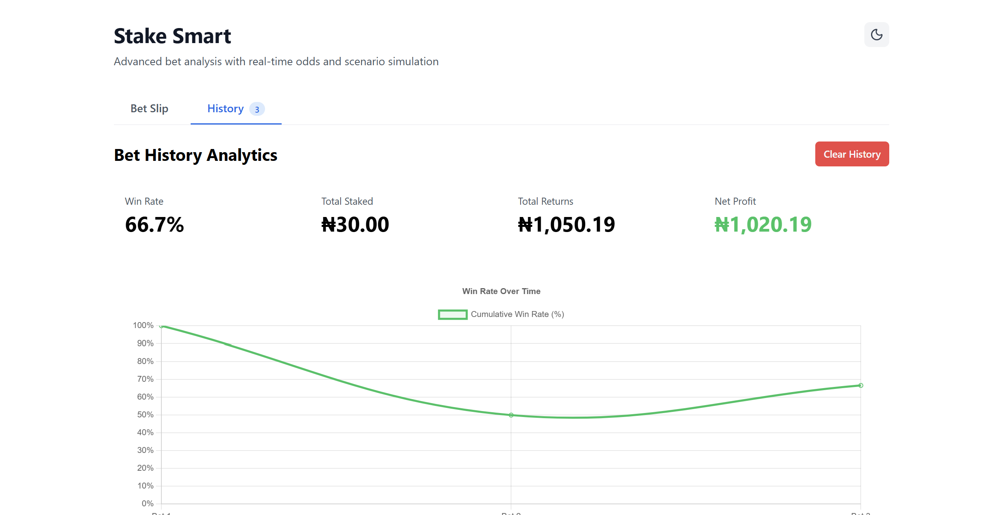
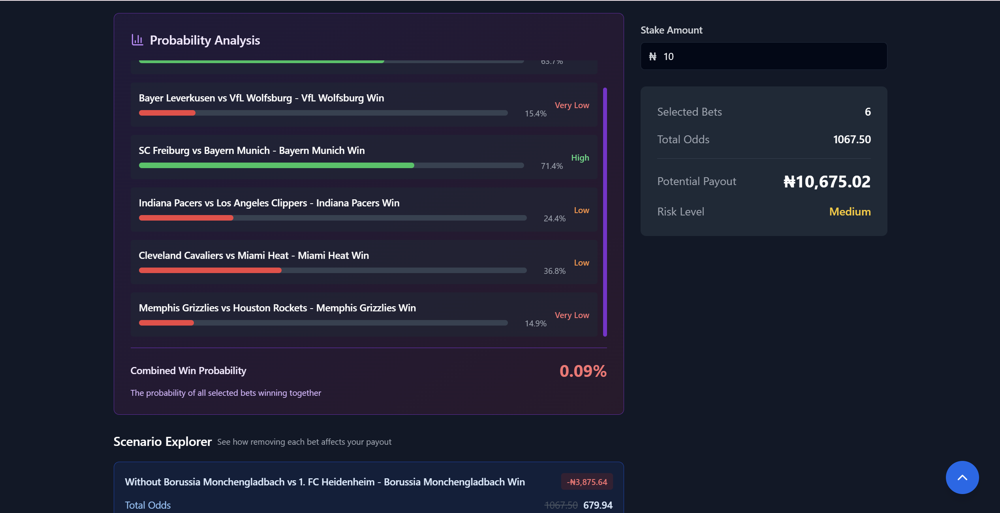

# Stake Smart

A betting calculator that shows you how multiple bets affect your actual chances of winning. Most bet slips only show potential payouts, but this shows the real probability math behind accumulator bets.

**Live demo:** [stake-smart.vercel.app](https://stake-smart.vercel.app)

## What it does

When you combine multiple bets, your win probability drops exponentially. This app calculates and visualizes that so you can make informed decisions.

**Main features:**
- Scenario Explorer - generates alternative bet combinations automatically
- Bet History with charts showing win rates and trends
- Live odds from The Odds API (football, basketball, etc)
- Probability calculations with risk indicators
- Dark mode and mobile responsive

## Screenshots


*Main betting interface with live odds and probability analysis*


*Bet history analytics with Chart.js visualizations*


*Dark mode with enhanced contrast and accessibility*

## Tech Stack

Built with NX monorepo structure:

- **React 18** + **TypeScript** - UI and type safety
- **Vite** - Fast dev server and builds
- **Zustand** - State management with persistence
- **Tailwind CSS** + **shadcn/ui** - Styling with accessible components
- **Framer Motion** - Smooth animations
- **Sonner** - Toast notifications
- **Lucide React** - Icon library
- **Chart.js** - History analytics
- **Axios** - API calls with smart caching
- **The Odds API** - Live sports data

## Setup

```bash
# Install dependencies (using pnpm)
pnpm install

# Add your API key to .env
VITE_ODDS_API_KEY=your_key_here

# Run dev server
pnpm run dev
```

Get a free API key from [the-odds-api.com](https://the-odds-api.com/)

## Project Structure

```
stake-smart/
├── apps/web/          # Main React app
└── libs/
    ├── types/         # TypeScript interfaces
    ├── betting/       # Calculation functions
    ├── hooks/         # React hooks + Zustand stores
    ├── ui/            # Reusable components
    └── api/           # API client
```

Used NX for the monorepo setup - makes it easy to share code between packages with path aliases like `@stake-smart/ui`.

## Key Implementation Details

**API Caching Strategy**
- Zustand store with 10-minute cache expiration
- Prevents duplicate API calls on tab switches and page refreshes
- Reduces API usage by ~50% (500 req/month limit on free tier)
- Manual refresh option forces fresh data fetch

**Scenario Explorer**
- Uses `useMemo` to cache scenario calculations (expensive operation)
- Generates 5 variations by toggling different bet selections
- Staggered animations hide the recalculation time

**Bet History**
- Zustand store with persist middleware for localStorage
- Chart.js for line/bar/scatter plots
- Confirmation modal prevents accidental history deletion
- Tracks win rate, total staked, returns, profit/loss

**Probability Analysis**
- Scrollable container (max 400px) for large bet slips
- Implied probability: `1/odds × 100`
- Combined probability: multiply individual probabilities
- Risk levels based on average odds
- Color-coded indicators using switch statements

**UI Components**
- shadcn/ui components with Tailwind CSS
- Dark mode support with theme persistence
- Accessible button variants using CVA (class-variance-authority)
- Toast notifications with Sonner library

**Mobile UX**
- AnimatePresence for smooth transitions
- Replaces sticky sidebar on small screens
- Blur backdrop for modals with scroll lock

## Issues I ran into

1. **Scenario generation performance** - Fixed with memoization and pure functions
2. **API rate limits** - Limited to 500 requests/month on free tier, implemented smart caching
3. **Duplicate API calls** - Fixed by removing useCallback dependency chain and adding loading ref
4. **Duplicate bets** - Added validation to check match names before adding
5. **Chart.js integration** - Used react-chartjs-2 wrapper for declarative API

## Deployment

Deploy to Vercel:
```bash
pnpm run build
# Output: dist/apps/web/
```

**Note:** Update `vercel.json` if needed - build command should use `pnpm run build`

Set environment variables in Vercel dashboard:
- `VITE_ODDS_API_KEY`
- `VITE_ODDS_API_BASE_URL`

## License

MIT
